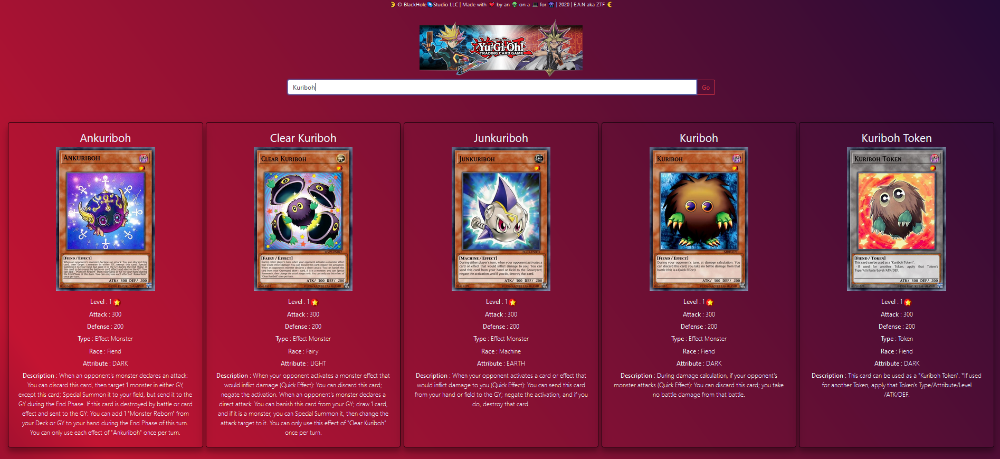
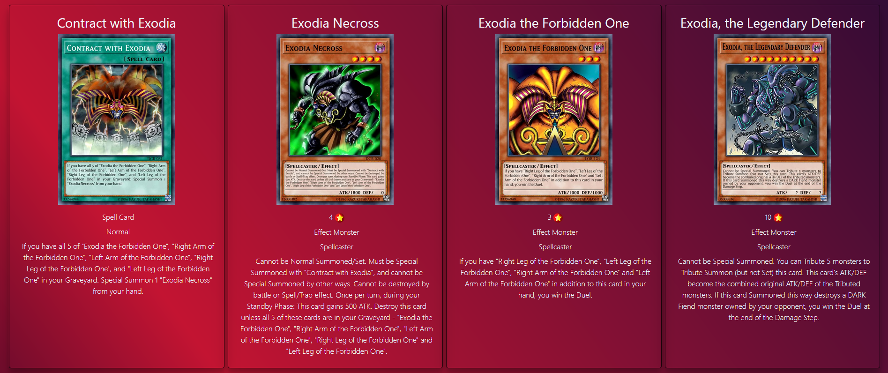
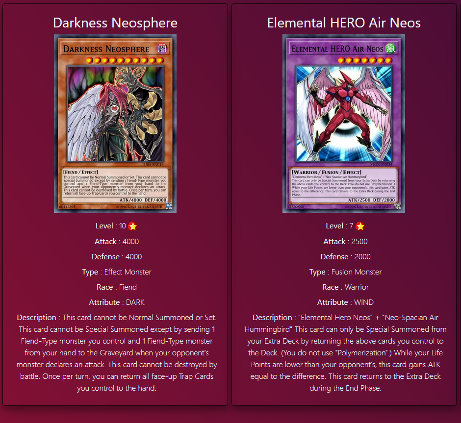

# YuGiOh card lister

Another iteration of my old project which was a bit messy .
This spa consumes the ygoprodeck api .
I'm not caching pictures , if you want to build on upon this , try and cach the images .

<details>
this is why :<p> 'Please download and store all data pulled from this API locally to keep the amount of API calls used to a minimum.</p>
<p> Failure to do so may result in either your IP address being blacklisted or the API being rolled back. '</p>
</details>


- **Functionalities**
<details>
  <p>This is a simple spa with minimum functionalities </p>
  <p>Search and display. </p>
</details>

## Search


## Display 




## Project setup

```
pnpm install
    OR
npm install
```

### Compiles and hot-reloads for development

```
pnpm run serve
     OR
npm run serve
```
### Compiles Build

```
pnpm run build
     OR
npm run build
```
## Contact me

```
you can contact me at ZTF666@protonmail.ch or via my portfolio
```

- **💎** [Portfolio](https://ztfportfolio.web.app/) **💎**

```
Made with 💘 by a 👨‍💻 on a 💻 | 2020 | ZTF666
```

